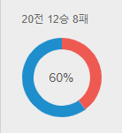

# Introduction to Svelte with Typescript

**This is a seminar for Master's students in [SNU-HCIL](http://hcil.snu.ac.kr).**  

 Svelte는 새로운 웹 컴포넌트 프레임워크로, 기존의 다른 프레임워크들과 다르게 아래와 같은 특징들을 가지고 있습니다.
* Write less code
* No virtual DOM
* Truly reactive

 이번 2020 여름 석사세미나에서는 6주동안 Svelte를 공부해보고, 개인별로 간단한 프로젝트를 하나씩 기획하여 svelte를 이용하여 구현해보는 것을 목표료 합니다.

## Learning Materials

### Svelte Official Page
* https://svelte.dev/

### Google Drive
* https://drive.google.com/drive/u/1/folders/15Sc01rRNdYYGBkbt8GyTyS1vt8_ffyID

## Syllabus

이번세미나는 온라인으로 Zoom을 통하여 진행됩니다.
매주 목요일 오후 4시부터 1시간 정도 세미나를 할 예정입니다.
세미나 과정에는 아래와 같은 내용이 포함됩니다.

1. 2개의 과제 (Week1, Week2)
2. 1개의 프로젝트 (Week3 ~ Week6) 

### Week 1: Svelte Tutorial (7/23)

* Svelte 튜토리얼 요약
* Svelte 에서 Typescript 를 이용 가능하도록 환경을 설정하는 법

#### HW1

* Svelte를 이용하여 React tutorial 의 Tic-Tac-Toe를 구현해본다. 
* 링크: https://ko.reactjs.org/tutorial/tutorial.html#completing-the-game
* 조건
  * 기본적으로 React tutorial 에서 구현한 기능들을 전부 구현해아 햡니다. 즉, React tutorial 에서 예시로 구현된 코드와 똑같이 작동해야 합니다.
  * 새로 돌을 놓거나 이전 상태로 전환할 때 svelte의 내장 transition이나 animation을 사용해야 합니다.

### Week 2: Using Svelte + D3 with Python Backend (7/30)

* Svelte에서 D3 사용법
* 파이썬 서버를 백엔드로 사용하여 Svelte 프론트와 통신하는 법

#### HW2

* Play Tic-tac-toe with simple AI
* 목표: HW1에서 만들었던 Tic-tac-toe 게임을 고쳐서 AI와 대전을 할 수 있도록 해보자.
* 세부 스펙:
  * 로그인 화면
    * 주소로 접속 시 로그인 화면으로 접근하도록 한다.
    * 로그인 정보를 입력하면 python 서버와의 통신을 통하여 인증을 하고, 계정의 전적 정보(승/무/패)를 불러온다.
    * 로그인에 성공하면 게임 화면으로 넘어간다.
  * 게임 화면
    * HW1을 베이스로 한다. (화면에서도 보이지 않도록 한다.)
    * 플레이어는 X로 플레이 하고, AI는 O로 플레이 한다.
    * 플레이어가 수를 두면, 서버와의 통신을 통해서 AI의 다음 수를 받아온다. AI는 playAI.py 파일에 간단한 AI가 구현이 되어있다.
    * 새로운 게임 시작 시 플레이어는 항상 선공이다.
    * History 기능은 비활성화한다.
    * Restart 버튼을 활성화하여, 클릭 시 현재까지의 플레이 기록을 지우고 처음 상태로 돌아가도록 한다.
    * 게임의 결과(승/무/패)가 결정되면, 서버와의 통신을 통해서 전적을 업데이트 해준다.
  * 전적 화면
    * 게임화면 우측에 전적화면을 새로 만든다.
    * 전적을 x전 y승 z무 w패 형식으로 표시한다.
    * Pie chart를 통해서 전적 정보를 시각화 해준다.
    * DB의 전적이 업데이트 되면 전적 화면더 이에 맞추어서 업데이트가 되어야 한다. 
    
  * playAI
    * playAI 는 현재 Tic-tac-toe 플레이 상황을 input으로 받아서, 다음으로 AI가 수를 놓을 위치를 반환한다.
    * input: 'O', 'X', None 으로 구성된 길이가 9인 list. HW1의 square 변수와 거의 동일하다. 
    * output: 0 ~ 8 사이의 정수

### Week 3: Project Proposal (8/6)

* 프로젝트 목표 제시
* 6분 발표 + 3분 피드백

### Week 4: Present Project Proposal (8/13)

* 진행상황 공유 & 코드리뷰

### Week 5: Lecture by Group 1 (8/20)

* 진행상황 공유 & 코드리뷰

### Week 6: Project Presentation (8/27)

* 프로젝트 결과물 발표
* 10분 발표 + 5분 피드백
* 마지막 시간이므로 평소보다 시간이 많이 (2시간 정도) 소요될 예정입니다.

## Participants

* 정석원
* 고형권
* 박석현
* 백은수
* 전현
* 안단태
* 이용석
* 한구현